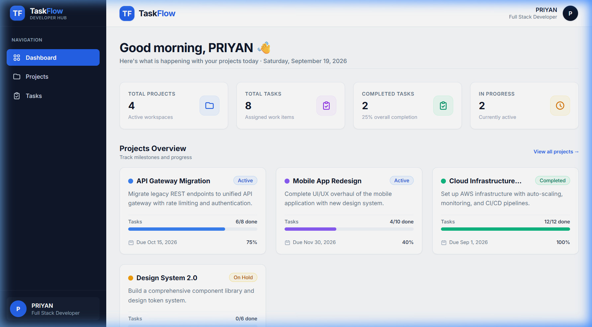
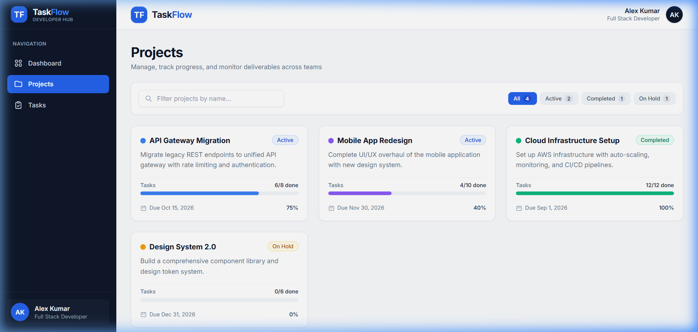
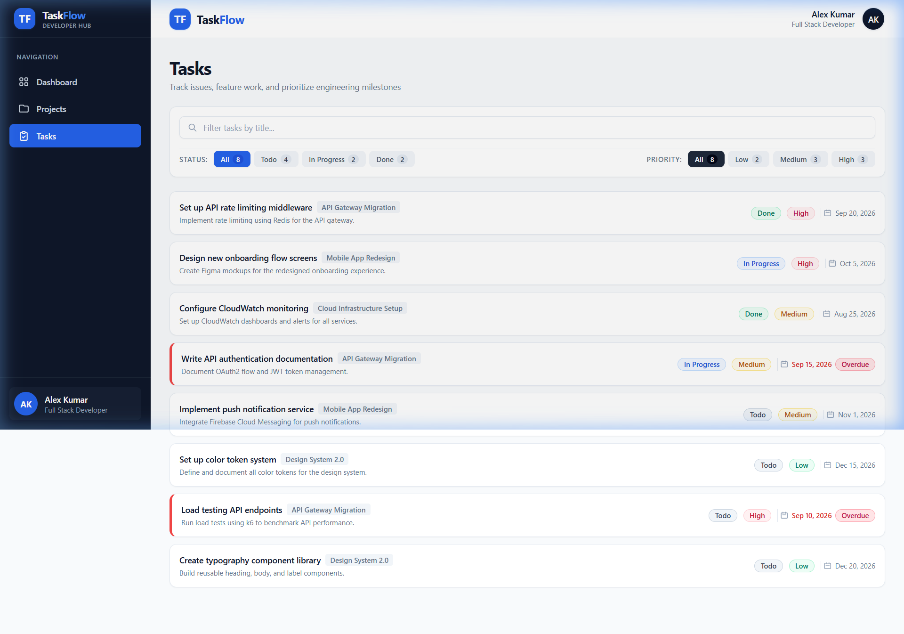
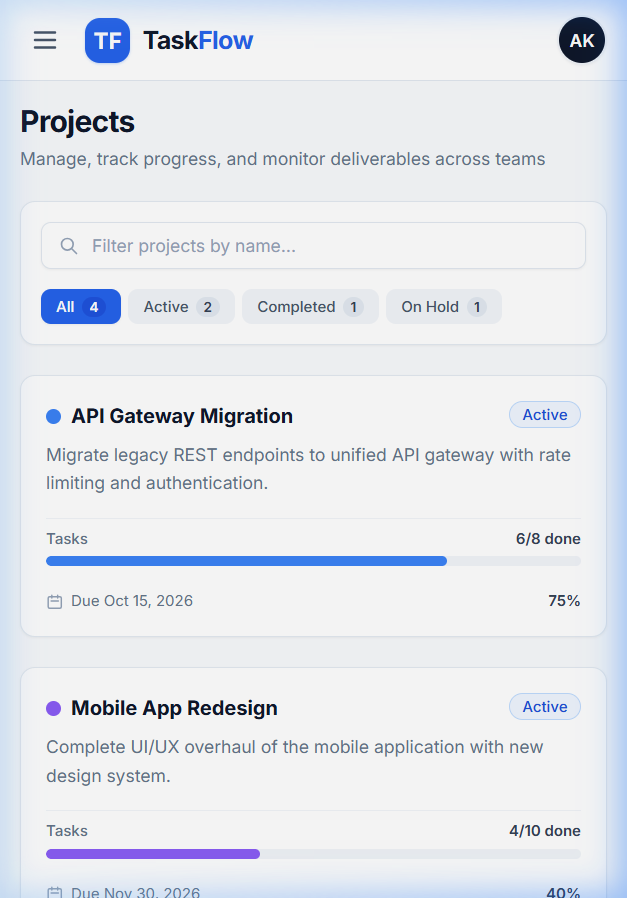
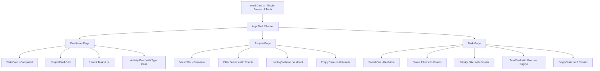

# TaskFlow — Developer Productivity Dashboard

<div align="center">

[](https://react.dev/)
[](https://vitejs.dev/)
[](https://tailwindcss.com/)
[](https://reactrouter.com/)
[](https://www.typescriptlang.org/)
[](https://github.com/)

<p align="center">
  <b>A responsive Developer Productivity Dashboard engineered for high-performance engineering teams to monitor sprints, track deliverables, and visualize project velocity in real time.</b>
</p>

*Built for the Innovation Hacks Full Stack Development Internship Evaluation.*

</div>

---

## Visual Preview

### Desktop Dashboard View


<div align="center">

| Projects Explorer | Tasks & Overdue Tracker | Mobile Responsive (375px) |
| :---: | :---: | :---: |
|  |  |  |

</div>

---

## Key Features

| Feature | Description | Implementation Details |
| :--- | :--- | :--- |
| **Dynamic Analytics Hub** | 4 computed metrics calculating project & task velocity in real time. | Zero hardcoded numbers; dynamically derived from active state arrays. |
| **Real-Time Instant Search** | Low-latency client-side search filtering by project title or task name. | Real-time state binding with instant character matching and clear button. |
| **Multi-Dimensional Filters** | Combined search, status, and priority filtering operating simultaneously. | Boolean conjunction logic (`search && status && priority`). |
| **Overdue Detection System** | Visual alerts for work items past their completion deadline. | Compares `dueDate < new Date() && status !== 'done'` with red indicator & left border. |
| **Progress Visualization** | Clean visual progress bars and completion ratios for each milestone. | Normalized percentage engine with dynamic color token allocation. |
| **Simulated Mount Skeletons** | Smooth loading skeleton placeholders on view transitions. | 1-second pulse skeleton state on page mount before content paint. |
| **Zero-State Resilience** | Illustrated empty states with one-click filter resets. | Friendly feedback when queries yield no matches, preventing dead-ends. |
| **Adaptive Viewport Engine** | Mobile-first architecture supporting single-column to 3-column layouts. | Desktop sidebar (`#0f172a`), tablet multi-column, mobile drawer navigation. |

---

## Internship Evaluation Compliance

All evaluation deliverables specified for the internship assessment have been implemented and verified:

| # | Requirement | Status | File Reference |
| :-: | :--- | :--: | :--- |
| **1** | **Clean URL Routing** (`react-router-dom`) with `/` redirecting to `/dashboard` | Verified | [`src/App.jsx`](src/App.jsx) |
| **2** | **TypeScript Interfaces** (`User`, `Project`, `Task`, `Activity`, `TaskStatus`, etc.) | Verified | [`src/types/index.ts`](src/types/index.ts) |
| **3** | **Environment Configuration** (`.env.example` and `.env`) | Verified | [`.env.example`](.env.example) |
| **4** | **Documentation Integrity** (Tech Stack, Quick Start, Folder Hierarchy) | Verified | [`README.md`](README.md) |
| **5** | **Computed Stats Engine** (Projects, Tasks, Completed, In-Progress derived from data) | Verified | [`src/pages/DashboardPage.jsx`](src/pages/DashboardPage.jsx) |
| **6** | **Overdue Card Highlighting** (`border-l-4 border-red-500` + red "Overdue" badge) | Verified | [`src/components/TaskCard.jsx`](src/components/TaskCard.jsx) |
| **7** | **Dynamic Project Filter Badges** (`All (4)`, `Active (2)`, `Completed (1)`, `On Hold (1)`) | Verified | [`src/pages/ProjectsPage.jsx`](src/pages/ProjectsPage.jsx) |
| **8** | **Dynamic Task Filter Badges** (Status counts and Priority counts) | Verified | [`src/pages/TasksPage.jsx`](src/pages/TasksPage.jsx) |
| **9** | **Simultaneous Multi-Filter Conjunction** (Search + Status + Priority) | Verified | [`src/pages/TasksPage.jsx`](src/pages/TasksPage.jsx) |
| **10** | **Activity Type SVG Mapping** (`create`=green plus, `update`=blue pencil, `complete`=check, `delete`=trash) | Verified | [`src/components/Icons.jsx`](src/components/Icons.jsx) |

---

## Tech Stack & Design System

### Technology Stack
- **Framework**: [React 18](https://react.dev/) (Functional Components, Hooks)
- **Tooling & Bundler**: [Vite 5](https://vitejs.dev/) (ESM, Fast HMR)
- **Styling**: [Tailwind CSS 3](https://tailwindcss.com/) (Custom Design Tokens)
- **Client Routing**: [React Router DOM v6](https://reactrouter.com/) (Browser-based navigation)
- **Type Definitions**: TypeScript interfaces in [`src/types/index.ts`](src/types/index.ts)
- **Icons**: Custom, lightweight inline SVG components (Zero external icon library bloat)

### Color Palette & Token System
```
Sidebar Background :  #0f172a (Dark Navy)
Primary Accent     :  #3b82f6 (Blue 500)
Content Background :  #f8fafc (Slate 50)
Card Background    :  #ffffff (Pure White)

Status Tokens:
  - Todo           :  #6b7280 (Slate Gray)
  - In Progress    :  #3b82f6 (Blue)
  - Done           :  #10b981 (Emerald Green)
  - On Hold        :  #f59e0b (Amber)

Priority Tokens:
  - Low            :  #10b981 (Green)
  - Medium         :  #f59e0b (Yellow / Amber)
  - High           :  #ef4444 (Rose Red)
  - Overdue Alert  :  #ef4444 (Border-left 4px + Badge)
```

---

## Folder Structure

```
taskflow/
├── .env.example                 # Template for environment variables
├── .env                         # Active local environment variables
├── package.json                 # Project dependencies and build scripts
├── vite.config.js               # Vite bundler configuration
├── tailwind.config.js           # Tailwind CSS design system tokens
├── postcss.config.js            # PostCSS configuration
├── index.html                   # HTML template with Google Fonts (Inter)
├── README.md                    # Project documentation
├── screenshots/                 # High-resolution application screenshots
│   ├── dashboard.png
│   ├── projects.png
│   ├── tasks.png
│   └── mobile.png
└── src/
    ├── main.jsx                 # React root entrypoint with BrowserRouter
    ├── App.jsx                  # Application shell & route definitions
    ├── index.css                # Tailwind directives and custom scrollbar
    ├── types/
    │   └── index.ts             # TypeScript interfaces (User, Project, Task, etc.)
    ├── data/
    │   └── mockData.js          # Single source of truth for all mock records
    ├── components/
    │   ├── Badge.jsx            # Dynamic status, priority & overdue badge pill
    │   ├── EmptyState.jsx       # Illustrated zero-state with reset filter action
    │   ├── Icons.jsx            # Custom SVG icon set (status, navigation, actions)
    │   ├── LoadingSkeleton.jsx  # Pulse loading skeleton cards & list loaders
    │   ├── LoadingSpinner.jsx   # Animated vector loading spinner
    │   ├── Navbar.jsx           # Top navigation bar with active links & user profile
    │   ├── ProgressBar.jsx      # Progress bar rendering exact percentages
    │   ├── ProjectCard.jsx      # Project overview card with progress metrics
    │   ├── SearchBar.jsx        # Instant search input with clear trigger
    │   ├── Sidebar.jsx          # Desktop persistent navy (#0f172a) sidebar
    │   ├── StatsCard.jsx        # Metric summary card with accent styling
    │   └── TaskCard.jsx         # Task item with priority, due date & overdue check
    └── pages/
        ├── DashboardPage.jsx    # Primary landing view (Stats, Projects, Tasks, Activity)
        ├── ProjectsPage.jsx     # Projects view with real-time filter & count badges
        └── TasksPage.jsx        # Tasks view with combined search + status + priority
```

---

## Getting Started

### Prerequisites
- **Node.js**: `v18.0.0` or higher
- **npm**: `v9.0.0` or higher

### Installation & Local Setup

1. **Clone the repository:**
   ```bash
   git clone https://github.com/your-username/taskflow.git
   cd taskflow
   ```

2. **Install dependencies:**
   ```bash
   npm install
   ```

3. **Configure environment:**
   ```bash
   cp .env.example .env
   ```

4. **Start the development server:**
   ```bash
   npm run dev
   ```
   Open your browser and navigate to `http://localhost:5173`.

### Production Build

To produce an optimized production bundle:
```bash
npm run build
```

To preview the production build locally:
```bash
npm run preview
```

---

## Environment Variables

TaskFlow reads environment variables via Vite's `import.meta.env` standard:

| Variable | Default Value | Description |
| :--- | :--- | :--- |
| `VITE_APP_NAME` | `TaskFlow` | Display name of the application |
| `VITE_APP_VERSION` | `1.0.0` | Semantic application build version |

---

## Component Architecture & State Flow



---

## Testing & Verification Guide

### 1. Navigation Flow
- Visit `http://localhost:5173/` → Automatically redirects to `/dashboard`.
- Click **Projects** in the navigation → Route updates to `/projects` with active blue styling.
- Click **Tasks** in the navigation → Route updates to `/tasks` with active blue styling.

### 2. Real-Time Search & Combined Filtering
- On the **Projects Page**: Type `"API"` into the search input. The list instantly updates to show only *"API Gateway Migration"*.
- On the **Tasks Page**:
  1. Type `"API"` in the search bar.
  2. Select status filter **In Progress**.
  3. Select priority filter **Medium**.
  4. The list dynamically resolves to exactly 1 task: *"Write API authentication documentation"*.
  5. Enter a non-matching query like `"xyz123"`. The **EmptyState** component renders with a **"Reset Filters"** button that restores all records when clicked.

### 3. Overdue Item Intelligence
- View the task *"Write API authentication documentation"* (Due: Sep 15, 2026, Status: In Progress). Because the deadline has elapsed and the task is incomplete, it automatically displays:
  - A red left accent border (`border-l-4 border-l-red-500`)
  - A red **"Overdue"** badge next to the due date.
- Completed tasks with past deadlines (such as *"Configure CloudWatch monitoring"*) correctly suppress the overdue indicator.

---

## Author & Credits

- **Developer**: PRIYAN
- **Role**: Full Stack Developer
- **Email**: [priyan@taskflow.dev](mailto:priyan@taskflow.dev)
- **Program**: Innovation Hacks Full Stack Development Internship

---

## License

This project is licensed under the [MIT License](LICENSE).
