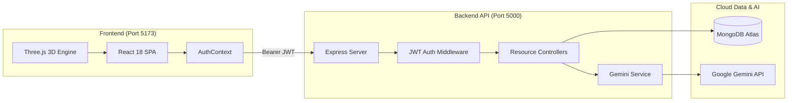
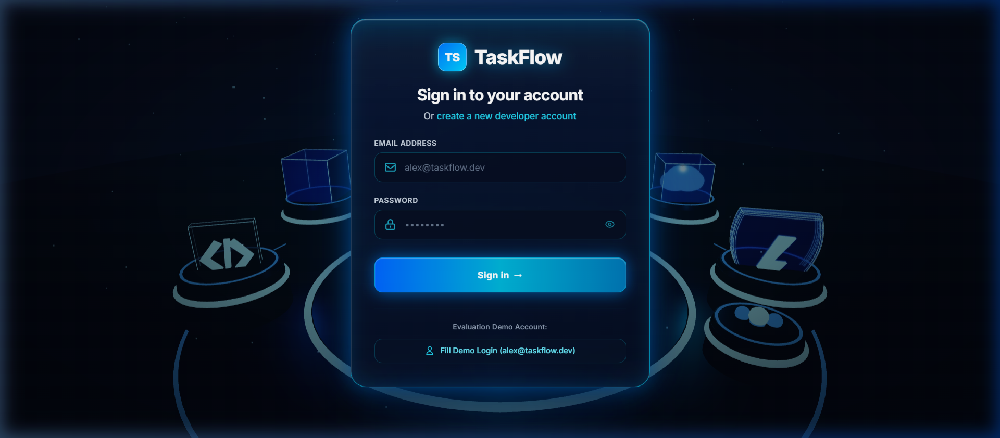
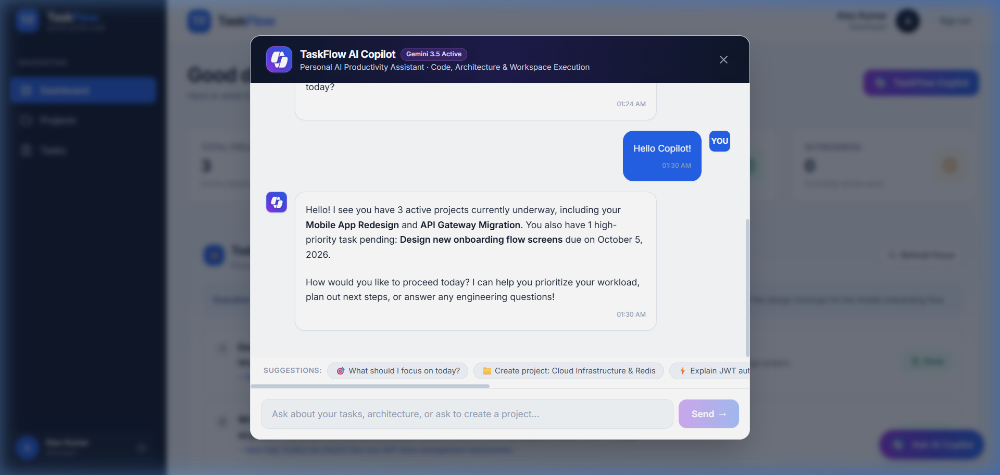
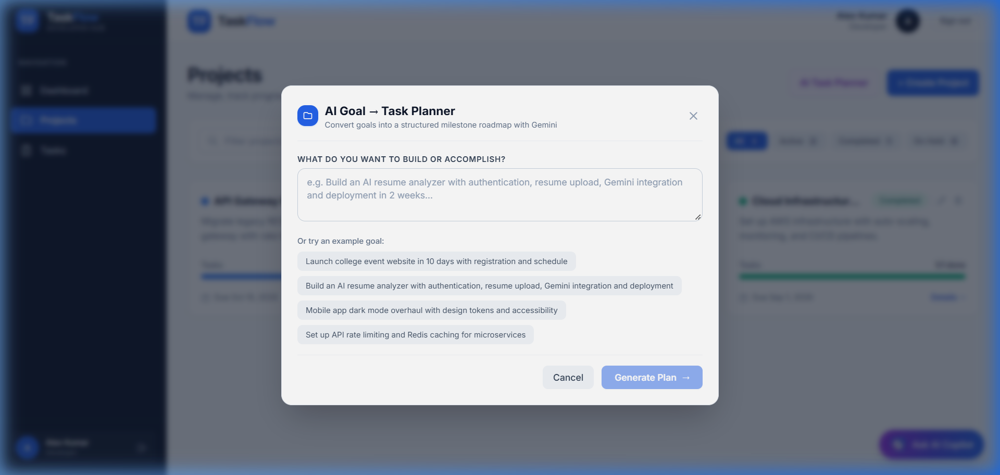

# TaskFlow

> **TaskFlow is a developer productivity workspace that combines project management, task management, productivity intelligence, and a personal AI assistant.**

[](https://react.dev/)
[](https://vitejs.dev/)
[](https://threejs.org/)
[](https://nodejs.org/)
[](https://expressjs.com/)
[](https://www.mongodb.com/atlas)
[](https://aistudio.google.com/)
[](https://drive.google.com/drive/folders/1lOcsKDX4hQXeIiA8OGPUns1Zn0E2vgxJ?usp=sharing)
[](LICENSE)

---

## 🎯 The Core Product Concept

$$\Large\textbf{Goal} \longrightarrow \textbf{Plan} \longrightarrow \textbf{Prioritize} \longrightarrow \textbf{Execute}$$

Engineering teams lose hours every sprint context-switching between disconnected roadmaps, backlog trackers, and developer documentation. TaskFlow bridges this gap by unifying full-stack task execution with server-orchestrated AI productivity intelligence.

```bash
# Clone and launch in under 60 seconds
git clone https://github.com/Priyan120-dev/TaskFlow-developer-productivity-dashboard.git
cd TaskFlow-developer-productivity-dashboard && npm install && cd taskflow-api && npm install && cd ..
```

---

## 📑 Table of Contents

1. [Overview](#1-overview)
2. [Key Features](#2-key-features)
3. [AI Capabilities](#3-ai-capabilities)
4. [Tech Stack](#4-tech-stack)
5. [Architecture Overview](#5-architecture-overview)
6. [Project Structure](#6-project-structure)
7. [Authentication & Authorization](#7-authentication--authorization)
8. [Database & Data Models](#8-database--data-models)
9. [REST API](#9-rest-api)
10. [Local Setup Guide](#10-local-setup-guide)
11. [Environment Variables](#11-environment-variables)
12. [Running Frontend](#12-running-frontend)
13. [Running Backend](#13-running-backend)
14. [AI Configuration & Failover](#14-ai-configuration--failover)
15. [Deployment (Render & Atlas)](#15-deployment)
16. [Screenshots](#16-screenshots)
17. [Demo & Presentation Script](#17-demo)
18. [Security](#18-security)
19. [Future Improvements](#19-future-improvements)
20. [Author & Acknowledgments](#20-author)

---

## 1. Overview

TaskFlow is an enterprise-grade developer workspace designed for the **Innovation Hacks Full Stack Development Internship**. It integrates an interactive React dashboard with an Express REST service, cloud-native MongoDB Atlas persistence, and Google Gemini Generative AI capabilities.

Rather than treating AI as a detached chatbot, TaskFlow ingests authorized live workspace data to calculate real-time priority briefings, decompose engineering goals into actionable milestone roadmaps, and propose safe database actions guarded by developer confirmation.

---

## 2. Key Features

| Capability | Technical Implementation |
|---|---|
| **JWT Authentication** | Secure token issuance, 7-day expiration, bcrypt password hashing (10 salt rounds). |
| **Protected Route Guards** | React Router client-side redirection with server-side Bearer verification. |
| **Project CRUD** | Complete initiative lifecycle management with custom color tags and deadline dates. |
| **Task CRUD** | Granular work-item management with status (`todo`, `in-progress`, `done`) and priority (`low`, `medium`, `high`). |
| **Multi-Dimensional Filters** | Simultaneous real-time filtering across text search, status pills, and priority badges. |
| **Dynamic Dashboard KPIs** | Live aggregations calculating total initiatives, active workload, and completion velocity. |
| **Overdue Intelligence** | Automated detection and visual urgency highlighting for tasks exceeding target deadlines. |
| **3D Cyber-Tech Login** | Procedural WebGL 3D scene using Three.js with metallic floor, rotating orbits, and floating developer icons. |
| **Custom Logo Branding** | Distinctive geometric logo mark deployed consistently across all Copilot modals, triggers, and cards. |
| **Cloud Persistence** | Zero mock-data dependencies; all entities persist to a live MongoDB Atlas cluster. |

---

## 3. AI Capabilities

TaskFlow incorporates three production-grade AI capabilities powered by Google Gemini:

### 🎯 A. AI Goal → Complete Task Plan (`POST /api/ai/plan`)
- Converts unstructured engineering goals into an ordered milestone roadmap.
- Emits task titles, technical descriptions, milestone priorities, and estimated hours.
- **Human-in-the-Loop Review**: Developer inspects and edits tasks before batch-persisting them to MongoDB Atlas.

### ⚡ B. AI Daily Focus & Priority Briefing (`GET /api/ai/daily-focus`)
- Ingests active tasks owned by the authenticated user to formulate an executive morning briefing.
- Highlights top 1–3 critical deliverables with concrete rationale (*Why now?*) and recommended immediate actions.
- **Anti-Hallucination Guard**: Server validates all AI-recommended task IDs against real MongoDB records.

### 💬 C. TaskFlow AI Copilot (`POST /api/ai/copilot`)
- Personal assistant specializing in full-stack architecture, debugging, and task breakdown.
- Contextually routes queries between general technical documentation and authorized live workspace data.
- **Guarded Action Proposal Pattern**: When asked to create projects or tasks, Copilot generates structured action proposals (`requiresConfirmation: true`). Database mutation occurs **only** when the user clicks **Confirm & Create**.

👉 *Deep dive documentation: [docs/AI_FEATURES.md](docs/AI_FEATURES.md)*

---

## 4. Tech Stack

### Frontend Client
- **Core**: React 18.3, Vite 5.4, JavaScript (ES2022)
- **Styling**: Tailwind CSS 3.4 (Custom dark slate and indigo design system)
- **3D Graphics**: Three.js 0.186 (WebGL scene, orbital tracks, procedural geometries)
- **Routing & Networking**: React Router DOM 6.22, Axios 1.7
- **Icons**: Custom SVG system with official Copilot branding symbol

### Backend Service (`taskflow-api`)
- **Runtime**: Node.js 18+ LTS, Express 4.19
- **Database & ODM**: MongoDB Atlas, Mongoose 8.3
- **Authentication**: JSON Web Token (`jsonwebtoken` 9.0), `bcryptjs` 3.0
- **AI Integration**: Google GenAI REST API (`gemini-3.5-flash-lite`)
- **Utilities**: CORS, Dotenv, UUID

---

## 5. Architecture Overview



### Critical Architecture Rule
$$\textbf{Gemini NEVER directly modifies MongoDB.}$$
All AI mutations follow: **AI Proposes &rarr; User Decides &rarr; Authorized REST APIs Execute.**

👉 *Full architecture documentation: [docs/ARCHITECTURE.md](docs/ARCHITECTURE.md)*

---

## 6. Project Structure

```text
TaskFlow/
├── public/                       # Static public assets & Copilot logo symbols
├── screenshots/                  # High-resolution application screenshots
├── src/                          # React frontend application
│   ├── assets/                   # Bundled branding images
│   ├── components/               # Reusable UI, modals, 3D WebGL scenes, icons
│   ├── context/                  # AuthContext and session state
│   ├── pages/                    # Route pages (Login, Register, Dashboard, Projects, Tasks)
│   ├── services/                 # Axios API client and route endpoints
│   ├── App.jsx                   # Application layout shell & global Copilot trigger
│   └── main.jsx                  # React DOM mount point
├── docs/                         # In-depth architectural documentation
│   ├── ARCHITECTURE.md           # Full-stack architecture & data flow diagrams
│   ├── AI_FEATURES.md            # Deep dive on AI capabilities & prompt architecture
│   ├── DEPLOYMENT.md             # Production guide for Render & Atlas
│   └── DEMO_GUIDE.md             # 3-5 minute presentation script
├── taskflow-api/                 # Express backend REST service
│   ├── src/
│   │   ├── config/               # Database connection lifecycle
│   │   ├── controllers/          # Business logic (Auth, Projects, Tasks, Stats, AI)
│   │   ├── middleware/           # JWT verification & error shielding
│   │   ├── models/               # Mongoose schemas (User, Project, Task)
│   │   ├── routes/               # Express route declarations
│   │   ├── services/             # Gemini API service & payload sanitizers
│   │   └── server.js             # Express application listener
│   ├── docs/
│   │   └── api.md                # Comprehensive REST API reference
│   ├── package.json
│   └── README.md
├── CONTRIBUTING.md               # Development & pull request guidelines
├── SECURITY.md                   # Security controls & disclosure policy
├── CHANGELOG.md                  # Milestone evolution history
└── package.json                  # Frontend dependencies & scripts
```

---

## 7. Authentication & Authorization

- **Password Storage**: Passwords are salted and hashed using `bcryptjs` with 10 rounds. Plaintext passwords never touch the database.
- **Token Mechanism**: Standard stateless JWT tokens signed with `JWT_SECRET`. Tokens include user ID, email, and role.
- **Route Protection**: Unauthenticated requests are intercepted by `ProtectedRoute.jsx` on the client and `auth.middleware.js` on the server.
- **Ownership Scoping**: All database queries for write operations strictly filter by `req.user.id`. The server ignores client-supplied `ownerId` values.

---

## 8. Database & Data Models

### Mongoose Relationships
- **User &rarr; Projects**: One-to-Many (`Project.owner` references `User._id`).
- **Project &rarr; Tasks**: One-to-Many (`Task.project` references `Project._id`).
- **User &rarr; Tasks**: One-to-Many (`Task.assignee` and `Task.createdBy` reference `User._id`).

### Seed Data
The database seeder initializes default developer credentials:
- **Email**: `alex@taskflow.dev`
- **Password**: `password123`
- **Role**: `developer`
- **Pre-populated Entities**: 3 starter initiatives and 5 milestone deliverables.

---

## 9. REST API

| Endpoint | Method | Access | Description |
|---|---|:---:|---|
| `/api/health` | `GET` | Public | System status, database connection, timestamp. |
| `/api/auth/register` | `POST` | Public | Register new user and receive JWT. |
| `/api/auth/login` | `POST` | Public | Authenticate user and receive JWT. |
| `/api/auth/me` | `GET` | Protected | Fetch authenticated user profile. |
| `/api/projects` | `GET`, `POST` | Protected | Query and create user projects. |
| `/api/projects/:id` | `GET`, `PUT`, `DELETE` | Protected | Read, update, and cascading delete projects. |
| `/api/tasks` | `GET`, `POST` | Protected | Query (with filters) and create tasks. |
| `/api/tasks/:id` | `GET`, `PUT`, `DELETE` | Protected | Read, update status/priority, delete tasks. |
| `/api/stats` | `GET` | Protected | Compute workspace metrics and completion velocity. |
| `/api/ai/plan` | `POST` | Protected | Decompose goals into milestone roadmap. |
| `/api/ai/daily-focus` | `GET` | Protected | Generate AI executive morning briefing. |
| `/api/ai/copilot` | `POST` | Protected | Copilot conversational Q&A and action proposals. |

👉 *Full API Reference: [taskflow-api/docs/api.md](taskflow-api/docs/api.md)*

---

## 10. Local Setup Guide

### Prerequisites
- Node.js v18.0.0 or higher
- npm v9.0.0 or higher
- MongoDB Atlas cluster connection string
- Google Gemini API key ([Google AI Studio](https://aistudio.google.com/))

```bash
# 1. Clone the repository
git clone https://github.com/Priyan120-dev/TaskFlow-developer-productivity-dashboard.git
cd TaskFlow-developer-productivity-dashboard

# 2. Install frontend dependencies
npm install

# 3. Install backend dependencies
cd taskflow-api
npm install
cd ..
```

---

## 11. Environment Variables

### Frontend Configuration (`.env`)
Create `.env` in the project root:
```env
VITE_APP_NAME=TaskFlow
VITE_APP_VERSION=1.0.0
VITE_API_URL=http://localhost:5000/api
```

### Backend Configuration (`taskflow-api/.env`)
Create `.env` inside `taskflow-api/`:
```env
PORT=5000
NODE_ENV=development
CORS_ORIGIN=http://localhost:5173
JWT_SECRET=your_jwt_secret_key_minimum_32_characters
MONGODB_URI=mongodb+srv://<username>:<password>@cluster0.xxxxx.mongodb.net/taskflow?retryWrites=true&w=majority
GEMINI_API_KEY=your_gemini_api_key_here
GEMINI_MODEL=gemini-3.5-flash-lite
```

> [!NOTE]
> Example templates (`.env.example`) contain only placeholders. Never commit actual connection strings or secrets.

---

## 12. Running Frontend

From the root directory:
```bash
npm run dev
```
The React development server launches at `http://localhost:5173`.

To build the production bundle:
```bash
npm run build
```

---

## 13. Running Backend

From the root directory, open a new terminal:
```bash
cd taskflow-api

# Seed the initial database (runs once)
npm run seed

# Start server in development mode
npm run dev
```
The Express REST service starts at `http://localhost:5000`.

---

## 14. AI Configuration & Failover

TaskFlow connects to Google Gemini using direct server-side REST requests to the official `generateContent` v1beta endpoint:
- **Active Model**: `gemini-3.5-flash-lite` (Configurable via `GEMINI_MODEL`).
- **Failover Sequence**: `gemini-3.5-flash-lite` &rarr; `gemini-3.1-flash-lite` &rarr; `gemini-flash-lite-latest` &rarr; `gemini-flash-latest` &rarr; `gemini-3.6-flash`.
- **Payload Sanitization**: The server helper `buildGeminiContents` guarantees strictly alternating user/model turns, discards empty parts, and enforces non-empty `text` strings, completely eliminating protobuf uninitialized field errors.

---

## 15. Deployment

TaskFlow is optimized for production deployment on **Render** and **MongoDB Atlas**:
- **Frontend**: Render Static Site (Build command: `npm install && chmod +x node_modules/.bin/vite && npm run build`, Publish directory: `dist`, SPA Rewrite: `/*` &rarr; `/index.html`).
- **Backend**: Render Web Service (Root directory: `taskflow-api`, Build: `npm install`, Start: `npm start`).
- **Database**: MongoDB Atlas M0 Free Cluster.
- **Infrastructure as Code**: Automated Blueprint deployment via [`render.yaml`](render.yaml).

👉 *Complete step-by-step production deployment guide: [docs/DEPLOYMENT.md](docs/DEPLOYMENT.md)*

---

## 16. Screenshots

<div align="center">

### 3D Cyber-Tech Futuristic Login


### Developer Productivity Dashboard & AI Daily Focus


### TaskFlow AI Copilot with Custom Branding


### AI Goal → Complete Task Planner


| Projects Explorer | Tasks Board | Mobile Responsive (375px) |
|:---:|:---:|:---:|
|  |  |  |

</div>

---

## 17. Demo

### 🎥 Demo Video Access
Watch the full recorded demonstration of TaskFlow featuring the 3D WebGL login, interactive dashboard, manual CRUD, and all three Google Gemini AI workflows:
👉 **[Watch TaskFlow Demo Video on Google Drive](https://drive.google.com/drive/folders/1lOcsKDX4hQXeIiA8OGPUns1Zn0E2vgxJ?usp=sharing)**

### 3-Minute Live Presentation Track
1. **3D Login**: Showcase procedural Three.js WebGL scene with floating developer artifacts. Log in with `alex@taskflow.dev`.
2. **Dashboard**: Demonstrate real-time metric cards and the AI Daily Focus briefing.
3. **AI Task Planner**: Enter a natural language goal, review the generated roadmap, and click *Add All Tasks to Workspace*.
4. **TaskFlow Copilot**: Open Copilot, ask a technical question, then request: *"Create a project called Cloud Infrastructure"*. Show the confirmation-guarded action card.
5. **Persistence Check**: Refresh browser to verify zero data loss from MongoDB Atlas.

👉 *Read the full word-for-word presentation script: [docs/DEMO_GUIDE.md](docs/DEMO_GUIDE.md)*

---

## 18. Security

- **Server-Side API Key Isolation**: `GEMINI_API_KEY` is strictly confined to the backend. It never reaches client bundles.
- **Zero Automated Mutations**: Copilot never writes to the database without explicit user confirmation.
- **Input Sanitization**: Mongoose schema casting and ObjectId regex validation prevent injection attacks.
- **Zero Secrets Committed**: Verified clean Git history with automated gitignore rules.

👉 *Read our comprehensive security policy: [SECURITY.md](SECURITY.md)*

---

## 19. Future Improvements

- [ ] **GitHub Webhook Integration**: Automated task status transitions linked to pull request merges.
- [ ] **Team Workspaces & RBAC**: Granular role-based permissions (`admin`, `lead`, `contributor`).
- [ ] **Sprint Velocity Charts**: Burn-down charts and time estimation accuracy tracking.
- [ ] **WebSocket Real-Time Sync**: Multi-user live collaborative board updates.

---

## 20. Author

- **Developer**: PRIYAN
- **Role**: Full Stack Developer
- **Email**: [priyaniyappan120@gmail.com](mailto:priyaniyappan120@gmail.com)
- **Repository**: [Priyan120-dev/TaskFlow-developer-productivity-dashboard](https://github.com/Priyan120-dev/TaskFlow-developer-productivity-dashboard)
- **Program**: Innovation Hacks Full Stack Development Internship

---

## 📄 License
This project is licensed under the MIT License — see the [LICENSE](LICENSE) file for details.
