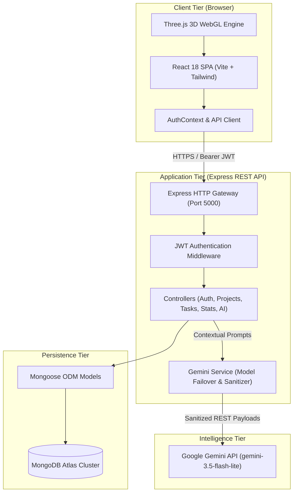
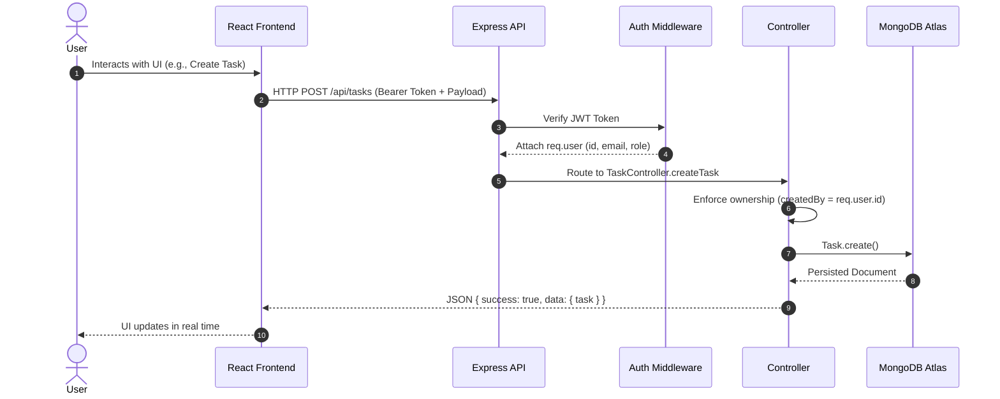
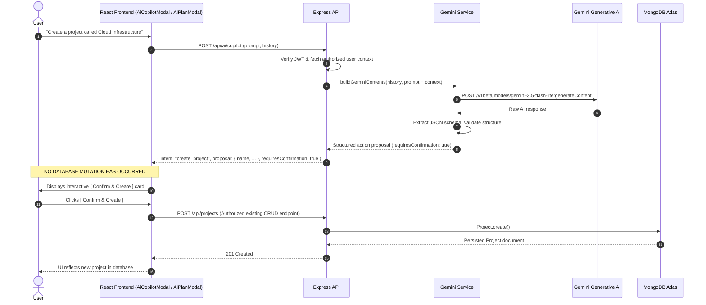
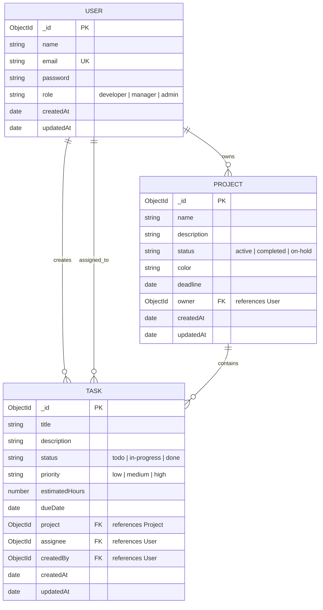

# TaskFlow Architecture Specification

This document provides a comprehensive technical overview of the **TaskFlow** system architecture, component hierarchy, data flows, database schemas, authentication boundaries, and the Google Gemini AI integration.

---

## 🏛️ System Overview

TaskFlow is engineered as a decoupled, multi-tier full-stack application:
- **Presentation Tier**: React 18 Single-Page Application (SPA) powered by Vite, Tailwind CSS, and Three.js for 3D WebGL rendering.
- **Application Tier**: Node.js and Express RESTful API providing authentication, authorization, business logic, analytics, and AI orchestration.
- **Persistence Tier**: MongoDB Atlas cloud document database accessed via the Mongoose Object Data Modeling (ODM) library.
- **Intelligence Tier**: Google Gemini Generative AI API integrated through authenticated server-side services.



---

## 🔁 End-to-End Request Flows

### 1. Standard Data Operations Flow (CRUD)



### 2. AI Intelligence Flow (Advisory & Guarded Mutations)

A core design principle of TaskFlow is that **Gemini NEVER directly modifies the database**. All AI operations follow a strict proposal and human confirmation lifecycle:



---

## 💻 Frontend Component Hierarchy

The React client is structured around reusable modular components, page views, and global context providers:

```text
src/
├── context/
│   └── AuthContext.jsx          # JWT authentication state, login, register, logout
├── components/
│   ├── CyberTechScene.jsx       # 3D Three.js WebGL futuristic canvas
│   ├── ProtectedRoute.jsx       # Route guard redirecting unauthenticated users to /login
│   ├── Navbar.jsx               # Top navigation, mobile menu, user identity badge
│   ├── Sidebar.jsx              # Desktop navigation hub
│   ├── StatsCard.jsx            # KPI metric cards with icons and trend data
│   ├── ProjectCard.jsx          # Project grid item with progress bar and task counters
│   ├── TaskCard.jsx             # Task item with priority badge and overdue detection
│   ├── ProjectModal.jsx         # Create/edit project dialog
│   ├── TaskModal.jsx            # Create/edit task dialog
│   ├── ConfirmationModal.jsx    # Generic deletion confirmation modal
│   ├── DailyFocusCard.jsx       # AI executive daily briefing widget
│   ├── AiPlanModal.jsx          # AI Goal -> Task Roadmap generator modal
│   ├── AiCopilotModal.jsx       # Global floating TaskFlow Copilot conversational modal
│   └── Icons.jsx                # SVG icons and custom Copilot logo symbol
├── pages/
│   ├── LoginPage.jsx            # 3D Cyber-Tech login page
│   ├── RegisterPage.jsx         # User registration page
│   ├── DashboardPage.jsx        # High-level analytics and Daily Focus view
│   ├── ProjectsPage.jsx         # Initiatives explorer with filter tabs
│   ├── ProjectDetailsPage.jsx   # Project view with scoped task management
│   └── TasksPage.jsx            # Global task manager with multi-filter queries
└── services/
    └── api.js                   # Axios client with Bearer token interceptor
```

---

## ⚙️ Backend API Architecture

The backend follows the Controller-Service-Repository architectural pattern:

```text
taskflow-api/src/
├── config/
│   └── database.js              # Mongoose connection with reconnection lifecycle
├── middleware/
│   ├── auth.middleware.js       # JWT Bearer verification & user injection
│   └── error.middleware.js      # Centralized error handler and sanitizer
├── models/
│   ├── User.js                  # User schema with bcrypt password hashing
│   ├── Project.js               # Project schema with status and owner references
│   └── Task.js                  # Task schema with priority, status, and project links
├── controllers/
│   ├── auth.controller.js       # Authentication logic (register, login, me)
│   ├── project.controller.js    # Project CRUD with ownership authorization
│   ├── task.controller.js       # Task CRUD with multi-field filtering
│   ├── stats.controller.js      # Aggregated metric computations
│   └── ai.controller.js         # AI goal planning, daily focus, and copilot
├── routes/
│   ├── auth.routes.js           # /api/auth
│   ├── project.routes.js        # /api/projects
│   ├── task.routes.js           # /api/tasks
│   ├── stats.routes.js          # /api/stats
│   ├── ai.routes.js             # /api/ai
│   └── health.routes.js         # /api/health
├── services/
│   └── gemini.service.js        # Google GenAI integration, failover, sanitizer
└── server.js                    # Express application entry point
```

---

## 🗄️ Database Schemas & Entity Relationships

The MongoDB Atlas database enforces relational integrity through Mongoose references:



### Relational Constraints
- **Cascading Awareness**: When querying projects, task counts (`taskCount`, `completedTasks`) are dynamically computed via MongoDB aggregations.
- **Index Optimization**: `User.email` is uniquely indexed; `Task.project`, `Task.assignee`, and `Project.owner` are indexed for sub-millisecond lookups.

---

## 🔐 Security Boundaries & Authorization

1. **Authentication Boundary**: Public endpoints are strictly limited to `/api/health`, `/api/auth/register`, and `/api/auth/login`. All other routes require a valid Bearer JWT.
2. **Authorization Boundary**: The server never trusts client-supplied ownership identifiers. Resource mutations enforce `owner = req.user.id`.
3. **AI Secret Isolation**: The `GEMINI_API_KEY` is inaccessible to browser JavaScript. Client requests communicate exclusively with Express `/api/ai/*`.
4. **LLM Mutation Barrier**: The Gemini service is prohibited from issuing database write operations directly. Every mutation requires explicit client-side user confirmation.
